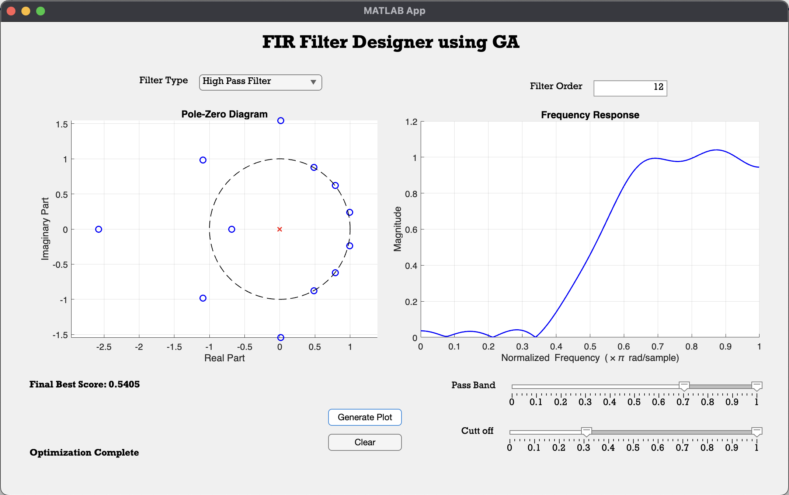
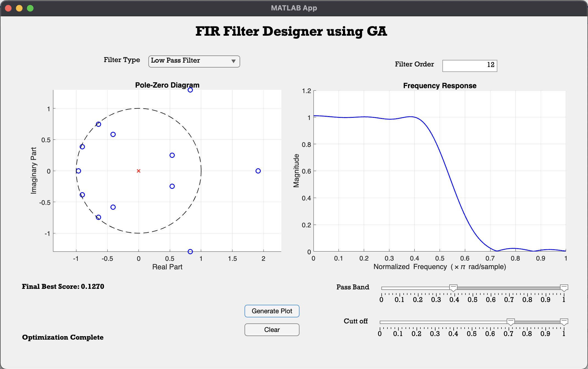

# FIR Filter Design App using Genetic Algorithm (GA)

## Overview

This project is a MATLAB App designed to create FIR filters using Genetic Algorithm (GA). The app allows users to choose the type of filter (Low Pass, High Pass, Band Pass, or Band Stop), input the filter specifications such as pass band and stop band frequencies, and select the filter order. Once the filter type and parameters are set, the app generates an FIR filter and displays the generation number, pole-zero diagram, and frequency response. These plots update until a proper filter is obtained via the Genetic Algorithm.

## Features

- **Filter Type Selection**: Dropdown menu to select from Low Pass, High Pass, Band Pass, or Band Stop filter types.
- **Frequency and Order Inputs**: Slider and text inputs to specify pass band and stop band frequency ranges and filter order.
- **Generate Filter**: Button to generate the FIR filter using Genetic Algorithm.
- **Dynamic Visualization**: Updates generation number, pole-zero diagram, and frequency response as the Genetic Algorithm progresses.
  
## Requirements

- MATLAB with App Designer
- MATLAB Optimization Toolbox (for Genetic Algorithm)
- MATLAB Signal Processing Toolbox

## How to Use the App

1. **Launch the App**: Open the `FIR.mlapp` file in MATLAB.
2. **Select Filter Type**: Use the dropdown menu to select the filter type (Low Pass, High Pass, Band Pass, or Band Stop).
3. **Set Filter Parameters**:
   - Use the sliders or input fields to define the pass band and stop band frequencies.
   - Input the desired filter order.
4. **Generate Filter**: Click the "Generate Filter" button to start the Genetic Algorithm process.
5. **Observe Results**: The generation number, pole-zero diagram, and frequency response will update as the Genetic Algorithm iterates.

## Screenshots

*App interface showing the pole-zero diagram and the frequency response of a high pass filter with stop-frequency from 0.3pi & pass-frequency from 0.7pi .*

*App interface showing the pole-zero diagram and the frequency response of a low pass filter with pass frequency till 0.3pi & stop frequency from 0.7pi.*

## Genetic Algorithm Details

The Genetic Algorithm (GA) is used to optimize the filter coefficients. The app performs the following steps:

- **Initialization**: A population of potential solutions (filter coefficients) is created randomly.
- **Selection**: The best solutions are selected based on their performance in the frequency domain.
- **Crossover**: Pairs of solutions are combined to generate new potential solutions.
- **Mutation**: Random modifications are applied to solutions to introduce diversity.
- **Iteration**: The process continues for several generations until a filter with an acceptable frequency response is obtained.

## Video Demonstration

A YouTube demonstration video is available for reference, showcasing how to use the app and how the Genetic Algorithm updates the generation number, pole-zero diagram, and frequency response during the process.

[Watch the Video](https://www.youtube.com/watch?v=your-video-id)

## Team Members

- **Member 1**: Arjun Sekar (22110034)
- **Member 2**: [Name]
- **Member 3** (if applicable): [Name]

## License

This project is licensed under the MIT License - see the [LICENSE](LICENSE) file for details.

## Acknowledgments

- Special thanks to the MATLAB community and online resources that helped us in building this app.
- The Genetic Algorithm was implemented using MATLAB's `ga` function from the Optimization Toolbox.

---
